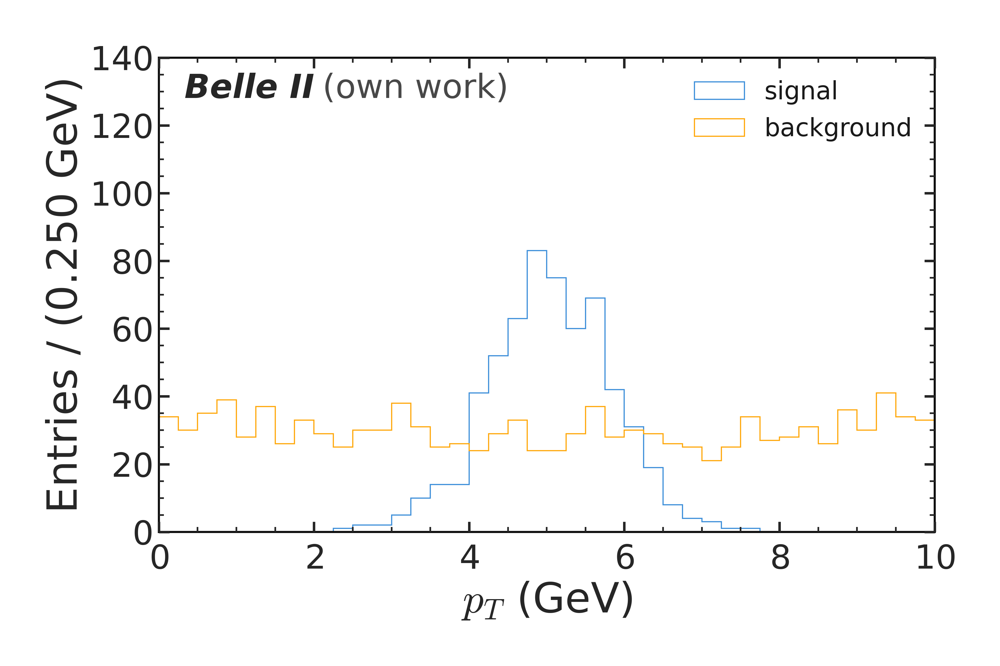
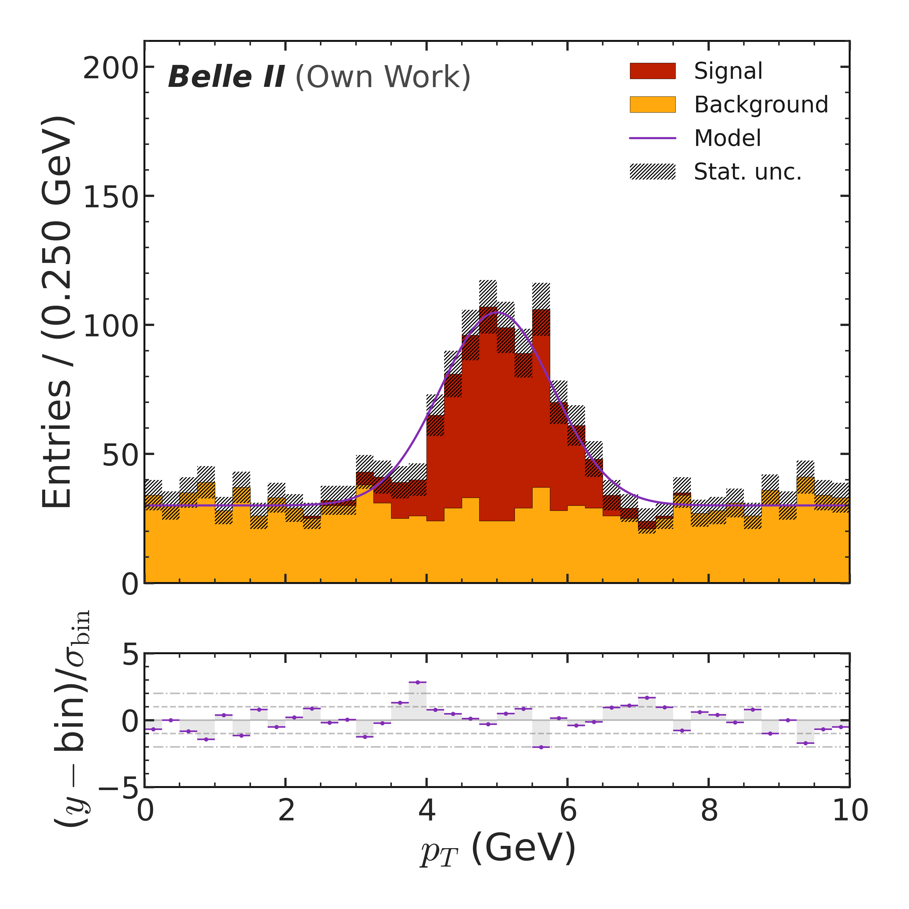
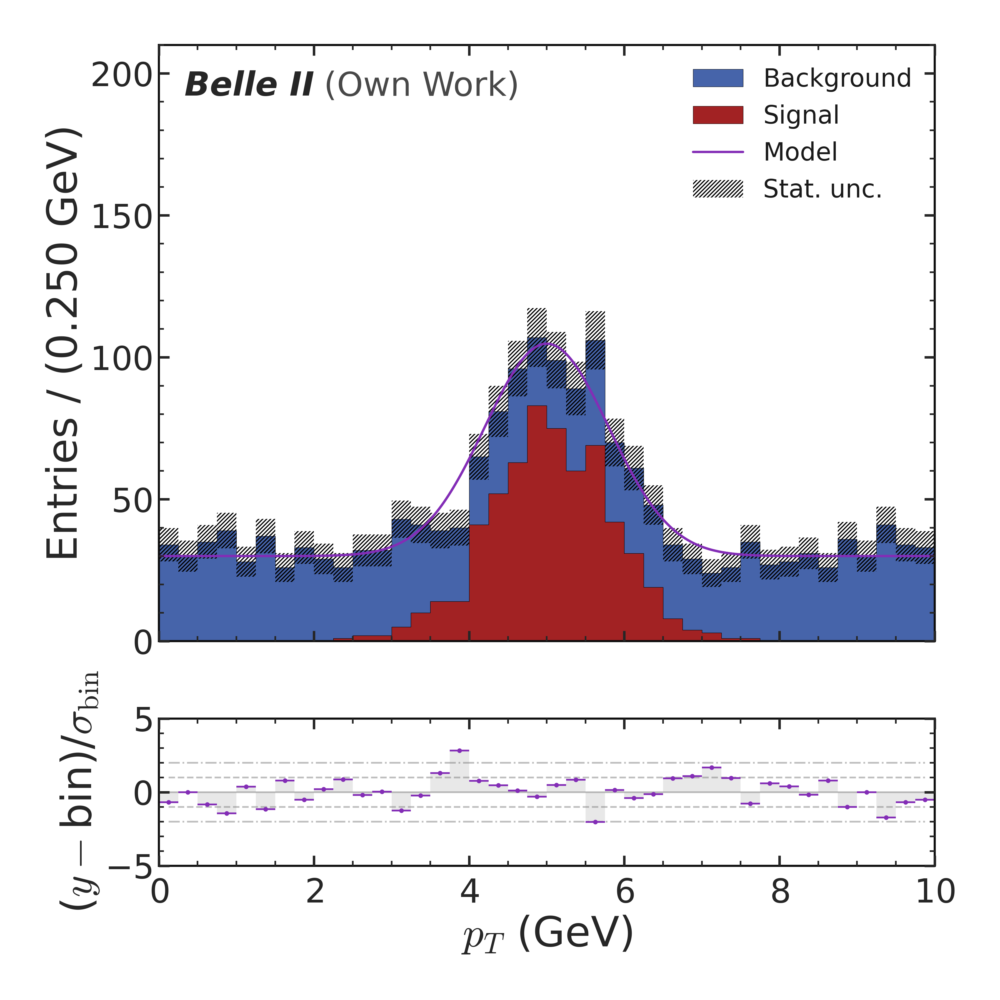

# AFPlotter

A standalone matplotlib-based plotting library for HEP analyses (histograms,
2D histograms, composed/generic plots, Polars-based lazy histogramming, and
an AST-based selection-query parser), with built-in Belle II / Generic
experiment styles. Register your own via `afplotter.experiments.registry`.

## Install

    pip install git+https://github.com/AlexanderHeidelbach/AFPlotter.git

Or for local development:

    git clone https://github.com/AlexanderHeidelbach/AFPlotter.git
    cd AFPlotter
    uv sync --extra dev

## Claude Code skill (optional)

AFPlotter ships a Claude Code skill so you can ask Claude to make plots for
you directly, using this library. Two ways to get it — pick whichever you
prefer:

**Claude Code plugin marketplace (recommended):**

    claude marketplace add AlexanderHeidelbach/AFPlotter
    claude plugin install afplotter

Update later with `claude plugin update afplotter`.

**One-command install** (installs both the package and the skill in one
step, no `claude` CLI concepts required):

    curl -sSL https://raw.githubusercontent.com/AlexanderHeidelbach/AFPlotter/main/install.sh | bash

Re-run the same command any time to pick up updates.

## Quickstart

```python
from afplotter import plot_histogram, set_experiment
import numpy as np

set_experiment("BelleII")  # or "Generic"

rng = np.random.default_rng(0)
plot_histogram(
    entries={"signal": rng.normal(5, 1, 500), "background": rng.uniform(0, 10, 1000)},
    bins=(0, 10, 41),
    xlabel="p_T (GeV)",
    stacked=True,
    save="pt.png",
)
```

Colors come from the [Petroff 10](https://arxiv.org/abs/2107.02270) sequence by default,
with its red held out of the cycle and reserved for signal components. Switch to KIT or LMU
colors (or register your own) with `set_palette(...)` — see
[Histograms → Colours](docs/histograms.md#colours).

## How you'd actually use this

In practice you don't write the Quickstart snippet by hand — you install the
[Claude Code skill](#claude-code-skill-optional) above and just ask for what you want, in plain
English, across a few turns. Here's a real three-turn sequence, using the same synthetic
signal/background sample throughout:

> Plot signal vs background for pt



The convenience layer handles this in one call: `plot_histogram(entries, bins, stacked=False)`.

> Now stack them and add a pull panel comparing to the model



A pull panel needs the full engine, not the convenience layer, so this escalates to
`Histogram`/`HistogramEntry` → `HistogramPlot` → `HistogramPlotter`, with `add_function` and
`add_pull` for the model overlay and pull panel.

> Switch to KIT colors



One line: `set_palette("KIT")`, called before the plot is rebuilt.

See `examples/workflow_demo.py` for the full runnable script behind these three images.

## Docs

- [Getting started](docs/getting-started.md) — experiment styles, `BasePlotter` properties
- [Histograms](docs/histograms.md) — stacked/step/pull plots, 2D histograms, colours, the convenience layer
- [Composed plots](docs/composed-plots.md) — `GenericPlotter`, fills/exclusion bands, `add_inset`
- [Selections](docs/selections.md) — the query-string filter parser

See `examples/` for runnable scripts.
